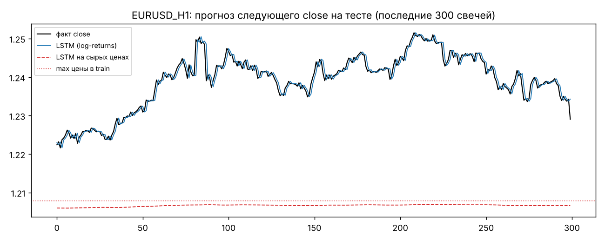
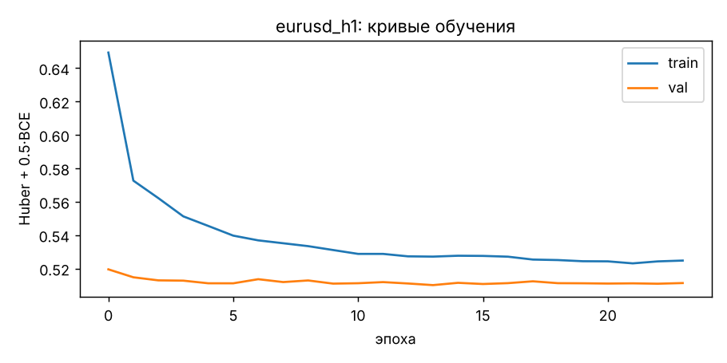
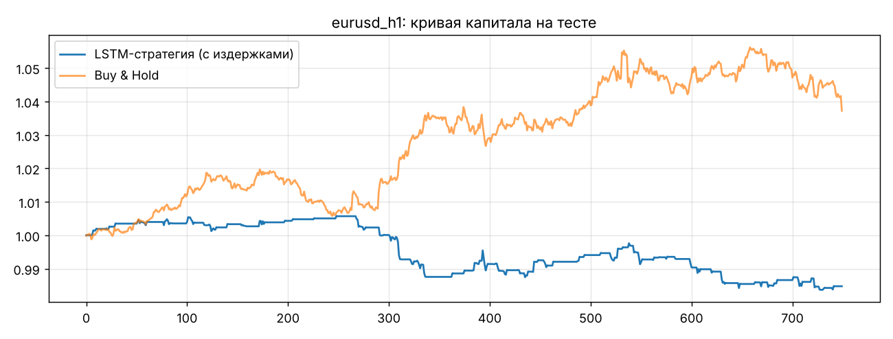
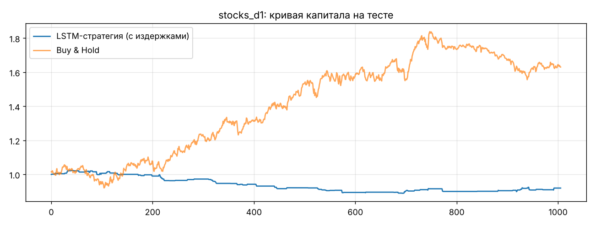

# Отчёт: LSTM-прогноз свечей и бэктест торговой стратегии

> Сгенерирован скриптом `ml/make_report.py` из `reports/*_metrics.json`. Все цифры — на **отложенной (тестовой)** части данных,
> которую модель не видела ни при обучении, ни при подборе гиперпараметров и порогов.

## 1. Данные

| Набор | Рынок | Таймфрейм | Период | Источник |
|---|---|---|---|---|
| EUR/USD | Forex | **H1** | 2017‑04‑19 … 2018‑02‑07, 5 000 свечей | выборка котировок из `backtesting.py` |
| GOOG, NVDA, ORCL, YHOO | акции США | **D1** | 1995…2015, ≈ 16 000 свечей | Yahoo Finance (наборы `backtrader`, `backtesting.py`) |

**Почему такие таймфреймы.** Для Forex выбран H1: на M1/M5 движение свечи сопоставимо со спредом (≈ 0.8 пункта) и
состоит в основном из микроструктурного шума, а на D1 за доступный период слишком мало точек. На H1 средний ход свечи ≈ 8
пунктов, т.е. в ~10 раз больше спреда, а 24 свечи в сутки дают достаточно данных. Для акций — D1: открытые внутридневные
истории короткие, а дневки доступны за 15–20 лет; торговая сессия с ночным гэпом естественно делится на дневные свечи.

**Разбиение — строго по времени, без перемешивания между выборками.** Сэмпл относится к выборке по времени
*свечи‑цели*, поэтому окно никогда не «заглядывает» в соседнюю выборку.

* EUR/USD: train 70 % / val 15 % / test 15 % → тест 2017-12-22 … 2018-02-07.
* Акции: общие для всех тикеров даты — train < 2010‑01‑01 ≤ val < 2012‑01‑01 ≤ test
  (2012-01-03 … 2015-12-31).

## 2. Предобработка, устойчивая к уровню цен (критерий 15 %)

Ни один признак не зависит от абсолютной цены (`common/features.py`, один и тот же код используется при обучении и на сервере):

| Признак | Формула |
|---|---|
| ret_1 | log(Cₜ / Cₜ₋₁) |
| gap, body | log(Oₜ / Cₜ₋₁), log(Cₜ / Oₜ) |
| upper, lower | log(Hₜ / max(O,C)), log(min(O,C) / Lₜ) — тени свечи |
| vol_20 | std(ret_1) за 20 свечей — волатильность |
| roc_10 | log(Cₜ / Cₜ₋₁₀) — скорость изменения цены (ROC) |
| z_20 | (C − SMA20) / STD20 — rolling z‑score цены |
| rsi_14 | (RSI14 − 50) / 50 |
| macd_h | (MACD − signal) / Cₜ — гистограмма MACD, нормированная на цену |
| vol_z | rolling z‑score log‑объёма (окно 50) |
| hour_sin/cos | час суток (только для H1) |

Затем признаки стандартизируются средними/СКО, посчитанными **только на train**, и обрезаются в [−5, 5].
**Цель — не цена, а лог‑приращения следующей свечи относительно текущего close:**
`log(Oₜ₊₁/Cₜ), log(Hₜ₊₁/Cₜ), log(Lₜ₊₁/Cₜ), log(Cₜ₊₁/Cₜ)`; цена восстанавливается как `Cₜ·exp(ŷ)`.

**Проверка.** Цена EUR/USD на тесте — 1.1835…1.2515, а на train максимум был
1.2079: тест в основном **выше всего, что модель видела**. Акции на тесте торгуются в 10–20 раз дороже, чем в
начале train. Контрольная LSTM на сырых ценах с глобальным min‑max:

| | EUR/USD H1, MAPE | Акции D1, MAPE |
|---|---|---|
| LSTM на сырых ценах (min‑max) | 1.388% | 33.86% |
| **LSTM на log‑returns (наша)** | **0.073%** | **1.171%** |

Сырая модель «упирается» в потолок min‑max (сигмоида не может выдать цену выше максимума train) — ошибка в
19× больше. Наша модель такой проблемы не имеет по построению.



## 3. Модель LSTM (критерий 20 %)

```
вход (lookback × 13 признаков)
 → LSTM (layers × hidden, dropout 0.2 между слоями)
 → LayerNorm → Dropout(0.2)
 ├─ reg‑голова: Linear(hidden → 4)  — log‑приращения O/H/L/C следующей свечи
 └─ cls‑голова: Linear(hidden → 1)  — логит P(close вырастет)
```

* **Функция потерь:** `Huber(reg) + 0.5·BCE(cls)`. Huber (SmoothL1) устойчив к «толстым хвостам» доходностей —
  редкие гэпы не доминируют в градиенте, как в MSE. BCE‑голова даёт вероятность направления → «уверенность» и BUY/SELL/HOLD.
  Цели нормированы на СКО приращения close (target_scale), чтобы обе части лосса были одного масштаба.
* **Оптимизатор:** Adam, lr = 1e‑3, weight decay 1e‑5, ReduceLROnPlateau(×0.5, patience 4), клиппинг градиента 1.0, batch 256.
* **Эпохи:** до 80, early stopping по val loss (patience 10), берутся веса лучшей эпохи. Реально останавливается на 15–45 эпохе:
  дальше модель начинает запоминать шум train.
* **Калибровка:** temperature scaling на валидации (T = 1.95 для EUR/USD, 0.76 для акций),
  чтобы «уверенность 55 %» действительно означала ~55 %.
* **Окно и размер сети** выбраны перебором по val loss:

EUR/USD H1:

| lookback | слоёв × нейронов | val loss | эпох до early stop |
|---|---|---|---|
| 24 | 1 × 32 | 0.51004 | 36 |
| 24 | 2 × 64 | 0.51012 | 36 |
| 48 | 1 × 32 | 0.51081 | 39 |
| 48 | 2 × 64 ✅ | 0.51003 | 24 |
| 96 | 1 × 32 | 0.51097 | 15 |
| 96 | 2 × 64 | 0.51100 | 13 |

Акции D1:

| lookback | слоёв × нейронов | val loss | эпох до early stop |
|---|---|---|---|
| 20 | 1 × 32 | 0.44895 | 26 |
| 20 | 2 × 64 | 0.44934 | 43 |
| 40 | 1 × 32 | 0.44881 | 30 |
| 40 | 2 × 64 | 0.44980 | 30 |
| 60 | 1 × 32 ✅ | 0.44862 | 34 |
| 60 | 2 × 64 | 0.44974 | 30 |

Для H1 оптимально окно 48 часов (двое суток: внутридневная сезонность + вчерашняя сессия); 96 — уже переобучение.
Для дневок — 60 дней (≈ квартал). Небольшие сети (1×32, 2×64) выигрывают: в финансовых рядах мало сигнала, и
крупная сеть быстрее переобучается. Обучение: `models/*.pt`, экспорт для сервера: `models/*.onnx` (паритет torch↔ONNX: max|Δ| ≈ 4e-09).



## 4. Качество прогноза на тесте

**EUR/USD H1** (750 свечей):

| Модель | MAE | RMSE | MAPE | Точность направления |
|---|---|---|---|---|
| **LSTM (log-returns, наша)** | 0.00089356 | 0.0012796 | 0.073% | 51.3% |
| GRU (та же схема) | 0.00089423 | 0.0012795 | 0.073% | 50.0% |
| ARIMA(1,0,1) по log-returns | 0.00089422 | 0.0012812 | 0.073% | 51.5% |
| Наивная: C̃(t+1)=C(t), направление = знак последнего Δ | 0.00089523 | 0.0012776 | 0.073% | 48.8% |
| LSTM на сырых ценах (global min-max) | 0.01715 | 0.022419 | 1.388% | 48.7% |

**Акции D1** (2805 свечей, 4 тикера):

| Модель | MAE | RMSE | MAPE | Точность направления |
|---|---|---|---|---|
| **LSTM (log-returns, наша)** | 0.96243 | 3.0933 | 1.171% | 51.1% |
| GRU (та же схема) | 0.96448 | 3.0966 | 1.173% | 50.9% |
| ARIMA(1,0,1) по log-returns | 0.95745 | 3.0875 | 1.167% | 52.1% |
| Наивная: C̃(t+1)=C(t), направление = знак последнего Δ | 0.95869 | 3.0904 | 1.166% | 48.7% |
| LSTM на сырых ценах (global min-max) | 14.105 | 20.476 | 33.864% | 48.7% |

По тикерам (LSTM):

| Тикер | MAPE | Точность направления |
|---|---|---|
| GOOG | 1.009% | 51.5% |
| NVDA | 1.244% | 50.9% |
| ORCL | 0.959% | 51.4% |
| YHOO | 1.322% | 50.9% |

Прогноз high/low/open: MAPE open 0.004%, high 0.049%, low 0.048% (EUR/USD).

**Интерпретация.** По MAE/RMSE LSTM, GRU и ARIMA практически совпадают с наивным прогнозом «завтра = сегодня» — это
ожидаемо: на горизонте одной свечи цена близка к случайному блужданию, и любая модель, минимизирующая ошибку,
прижимается к нулевому приращению. Сигнал содержится в **направлении**: LSTM угадывает его в 51.3% (EUR/USD) и
51.1% (акции) случаев против ~49 % у наивного momentum‑правила. Но разница между LSTM, GRU и ARIMA
(около 1 п.п.) — в пределах статистической погрешности (±1.8 п.п. для 750 свечей, ±0.9 п.п. для 2 800): честно говоря,
рекуррентная сеть **не превосходит** линейную ARIMA на горизонте одной свечи. Выигрыш LSTM — в возможности прогнозировать
всю свечу (open/high/low/close) и выдавать калиброванную вероятность направления для фильтрации сигналов.
MAE/RMSE для акций усреднены по тикерам с разным уровнем цен — сравнивать модели корректнее по MAPE.

## 5. Бэктест (критерий 5 %)

Правило — то же, что у бота на сервере: на закрытии свечи t
**BUY** (long), если `P(up) ≥ p_thr` и прогноз Δclose > r_thr; **SELL** (short), если `P(up) ≤ 1 − p_thr` и Δclose < −r_thr;
иначе **HOLD** — вне рынка. Позиция держится одну свечу. Издержки списываются с каждого изменения позиции.
Пороги подбираются **на валидации** (максимум Sharpe при ≥ 20 сделках) и на тесте не меняются.

**EUR/USD H1** — порог P(up) = 0.52, издержки 0.7 б.п. (≈ спред 0.8 пункта):

| Стратегия | Доходность | Годовая | Sharpe | Макс. просадка | Winrate | Сделок | В рынке |
|---|---|---|---|---|---|---|---|
| LSTM, **валидация** (подбор порогов) | −0.23% | −1.9% | −0.53 | −1.72% | 57% | 74 | 24% |
| **LSTM, тест, с издержками** | −1.52% | −12.0% | −3.09 | −2.20% | 58% | 78 | 26% |
| LSTM, тест, без издержек | −0.44% | −3.6% | −0.90 | −1.68% | 58% | 78 | 26% |
| LSTM без фильтра уверенности (P>0.5), тест | −1.54% | −12.1% | −1.86 | −2.91% | 61% | 154 | 79% |
| Buy & Hold, тест | +3.72% | +35.5% | 3.70 | −1.79% | 100% | 1 | 100% |



**Акции D1, равновзвешенный портфель из 4 тикеров** — порог P(up) = 0.56, издержки 5 б.п.:

| Стратегия | Доходность | Годовая | Sharpe | Макс. просадка | Winrate | Сделок | В рынке |
|---|---|---|---|---|---|---|---|
| LSTM, **валидация** (подбор порогов) | +36.40% | +16.8% | 1.42 | −8.96% | 64% | 187 | 13% |
| **LSTM, тест, с издержками** | −8.01% | −2.1% | −0.71 | −13.06% | 49% | 104 | 5% |
| LSTM, тест, без издержек | −5.59% | −1.4% | −0.49 | −11.60% | 49% | 104 | 5% |
| LSTM без фильтра уверенности (P>0.5), тест | +9.36% | +2.3% | 0.21 | −16.80% | 51% | 942 | 86% |
| Buy & Hold, тест | +63.04% | +13.0% | 0.90 | −15.37% | 100% | 4 | 100% |



Sharpe — годовой (×√6240 для H1, ×√252 для D1), просадка — по кривой капитала стратегии.

## 6. Прибыльна ли стратегия

**EUR/USD H1 — нет.** На тесте стратегия теряет 1.52% (Sharpe -3.09); без издержек — −0.44%. Уже на валидации ни одна комбинация порогов не дала положительного Sharpe, т.е. у модели нет устойчивого преимущества на часовых свечах EUR/USD. Причины: (1) EUR/USD — самый ликвидный рынок мира, краткосрочные закономерности в OHLCV сразу арбитражируются; (2) точность направления ~51 % при среднем ходе свечи ~8 пунктов даёт ожидаемый доход < 1 пункта на сделку — его съедает спред; (3) тест пришёлся на сильный тренд (+3.7 % buy & hold), а стратегия по построению симметрична и большую часть времени вне рынка. Честный вывод: LSTM‑сигнал на H1 Forex — это подсказка, а не источник альфы.

**Акции D1 — тоже нет.** На валидации (2010–2011) стратегия с порогом P(up) = 0.56 давала +36.40% (Sharpe 1.42), но на тесте (2012–2015) — −8.01% (Sharpe -0.71, просадка −13.06%), тогда как Buy & Hold того же портфеля заработал +63.04%. Причины:

1. **Смена режима рынка.** Пороги подобраны на боковом и волатильном 2010–2011, а тест — устойчивый бычий рынок. Из 130 дней в позиции 86 — шорты, т.е. уверенные сигналы модели в основном шли против тренда.
2. **Уверенность растёт в дни высокой волатильности** (отчётности, гэпы): там признаки «кричат» сильнее всего, но направление близко к монетке, а размах максимален — худший день стратегии −6.17%.
3. **51 % точности направления** при среднем движении ~1 % в день и 5 б.п. издержек на сделку даёт ожидание около нуля — любая неудачная серия уводит результат в минус.

Без фильтра уверенности (всегда в рынке по знаку прогноза) результат +9.36% — положительный, но многократно хуже пассивного владения.

**Итог.** LSTM даёт небольшое, статистически слабое преимущество в направлении движения (51–52 % против ~49 % у наивного правила), но его недостаточно, чтобы стабильно перекрыть издержки на горизонте одной свечи. Результаты на валидации заметно лучше теста — это классическое переобучение порогов под режим рынка. Поэтому в терминале рекомендация используется как подсказка с указанием уверенности и онлайн‑точности, а автоторговля — как демонстрация механики, а не как готовая прибыльная система.

## 7. Ограничения и что можно улучшить

* Мало данных EUR/USD (≈ 10 месяцев H1). На длинной истории (2010–2024) модель увидит разные режимы рынка.
* Горизонт одной свечи — самый шумный. Прогноз на 4–24 свечи и выход по стоп‑лоссу/тейк‑профиту обычно дают лучшее
  отношение сигнал/издержки.
* Не учтены свопы, проскальзывание при гэпах и ограничения на шорт акций.
* Порог уверенности подобран на одной валидации — для надёжности нужна walk‑forward‑оптимизация.
